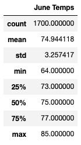
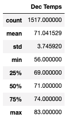

# Surfs Up Challenge

## Overview of Analysis

The purpose of this analysis was to gather temperature data for our client W. Avy for the months of June and December in Oahu. Then based on this data, we will determine if W. Avy's surf and ice cream shop business is sustainable all year. We are given a sqlite file that we will filter to get the temperatures for June and the temperatures for December. We will then convert the results to a dataframe and run summary statistics.

## Results

Above are the summary statistics for temperatures in June.

Above are the summary statistics for temperatures in December.

- When comparing the summary statistics for all temperatures in June and December, we can see that the average temperatures in June are 74.94 degrees and temperatures in December are slightly cooler at 71.04 degrees.

- We can see that the variance between the months is very slight. Temperatures in December are on average 3.9 degrees cooler than temperatures in June. This is a very small difference in comparison to the continental United States where temperatures between June and December can sometimes vary 10-20+ degrees.

- We can also see that the standard deviation is higher in December, meaning the temperatures in that month are more varied. The minimum temperature is 56 and the max temperature is 83 in comparison to a min/max of 64 and 85 in June. The 25%, 50%, and 75% percentiles are all 3-4 degrees lower in December than June.

## Summary

Overall the temperatures in December are just a few degrees cooler than June. Because the variance is so slight, it is safe to assume that W. Avy would be able to have a successful business between those months. But since W. Avy wants to know if his business is sustainable "all year round", it would make sense to run the same analysis for each month. The dataset we were given was limited as it only had data for temperature and precipitation. Since we have already run queries for both of those datapoints, we would need to bring in additional data for Oahu to query. We could use Open Weather's API to bring in wind speed and cloud data that we could run a similar analysis on since W. Avy would most likely prefer as little wind and cloudiness as possible. Wind speed is given as a numeric miles per hour and clouds are given a percentage of cloudiness. Both datapoints could be queried using the same analysis we ran on temperature and precipitation with summary statistics to analyze the results.